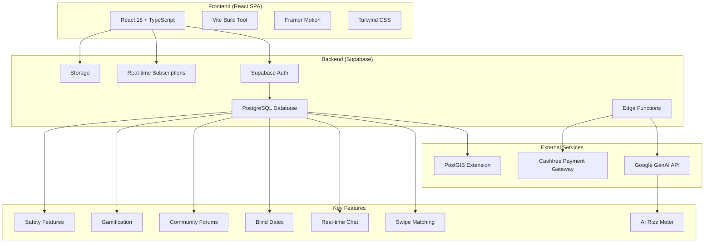

# CollegeCrush System Design

## Overview

CollegeCrush is a modern dating and social platform designed exclusively for college students, combining swipe-based matching, real-time messaging, location-based blind dates, and campus community forums. The platform emphasizes safety, gamification, and AI-powered features to create meaningful connections within verified educational communities.

## System Architecture

## System Components

### Frontend Layer
- **Framework**: React 18 with TypeScript for type-safe development
- **Build Tool**: Vite for fast development and optimized production builds
- **UI/UX**: Tailwind CSS for styling, Framer Motion for animations
- **State Management**: React Context for user state, theme, notifications, and presence
- **Routing**: Client-side routing with screen-based navigation
- **Key Screens**:
  - Authentication (OTP-based college email verification)
  - Onboarding (Profile creation)
  - Swipe Screen (Card-based matching)
  - Chat Screen (Real-time messaging)
  - Community Screen (Discussion forums)
  - Profile Management
  - Settings and Notifications

### Backend Layer (Supabase)
- **Authentication**: OTP-based login with college email verification supporting 50+ universities
- **Database**: PostgreSQL with PostGIS for location-based queries
- **Real-time**: WebSocket connections for instant messaging and presence indicators
- **Storage**: File uploads for profile pictures and media
- **Edge Functions**: Serverless functions for complex business logic (RPC calls)

### Database Schema Overview
- **Core Tables**:
  - `profiles`: User profiles with college verification, location, preferences
  - `swipes`: Swipe actions and matching logic
  - `conversations` & `messages`: Chat functionality
  - `blind_dates`: Location-based date proposals and management
  - `vibe_checks`: Post-date feedback system
- **Community Features**:
  - `community_posts` & `community_comments`: Discussion forums
  - `community_votes`: Upvote/downvote system
- **Gamification**:
  - `user_stats`: Activity tracking and points
  - `achievements` & `daily_challenges`: Reward system
- **Safety & Moderation**:
  - `reports_blocks`: User reporting and blocking
  - `notifications`: In-app notification system

### External Services
- **Google GenAI**: Conversation analysis for Rizz Meter (8 metrics: humor, empathy, consistency, etc.)
- **Cashfree**: Payment processing for premium subscriptions
- **PostGIS**: Geographic queries for location-based features

## Data Flow and User Interactions

### User Onboarding Flow
1. Email verification via college domain
2. OTP authentication
3. Profile creation with photos, bio, prompts
4. Location permission for proximity features
5. Privacy settings configuration

### Matching Flow
1. User swipes on profiles fetched via `get_swipe_candidates` RPC
2. Swipe recorded via `handle_swipe` function
3. Mutual right swipes create conversation and notifications
4. Real-time chat enabled post-match

### Blind Date Flow
1. User proposes date with location/time via `propose_blind_date`
2. Nearby users notified via real-time subscriptions
3. Proposal acceptance via `accept_proposal` RPC
4. Date completion triggers VibeCheck feedback
5. Mutual positive feedback creates permanent match

### Community Interaction Flow
1. Posts created anonymously or with profile
2. Real-time voting and commenting
3. Category-based content organization
4. Moderation through reporting system

## Security and Safety Features

### Authentication & Authorization
- College email domain verification (50+ universities supported)
- OTP-based login with rate limiting
- Row Level Security (RLS) policies on all database tables
- JWT token-based session management

### Data Privacy
- End-to-end encryption for sensitive communications
- User-controlled privacy settings (profile visibility, location sharing)
- GDPR-compliant data handling with user deletion capabilities
- Secure file storage with access controls

### Safety Protocols
- Emergency contact sharing during dates
- Location tracking with check-in reminders
- Comprehensive reporting and blocking system
- AI-powered content moderation for community posts
- Age verification through college enrollment

### Real-time Security
- Rate limiting on API calls
- Suspicious activity monitoring
- Automated account suspension for violations
- Secure WebSocket connections for real-time features

## Key Technical Features

### Real-time Capabilities
- Instant messaging with typing indicators
- Live presence status
- Real-time notifications
- Live community post updates

### AI Integration
- Rizz Meter: 8-dimensional conversation analysis
- Personalized icebreakers generation
- Intelligent matching algorithms
- Content sentiment analysis

### Gamification System
- Points-based leveling (swipes, matches, messages, dates)
- Daily challenges and streaks
- Achievement unlocks
- Leaderboards and social comparison

### Scalability Considerations
- Cloud-native architecture with Supabase
- Horizontal scaling through serverless functions
- Database optimization with indexes and PostGIS
- CDN for static assets
- Real-time connection pooling

## Performance Metrics
- Sub-3 second load times
- ~2.1MB gzipped bundle size
- 99% TypeScript coverage
- Optimized database queries with RPC functions

## Deployment and Monitoring
- Production deployment on Supabase infrastructure
- Automated testing and CI/CD pipelines
- Real-time monitoring and error tracking
- Performance analytics and user behavior tracking

## Future Scalability
- Multi-region deployment for global expansion
- Microservices architecture for feature isolation
- Advanced caching layers
- Machine learning for improved matching algorithms